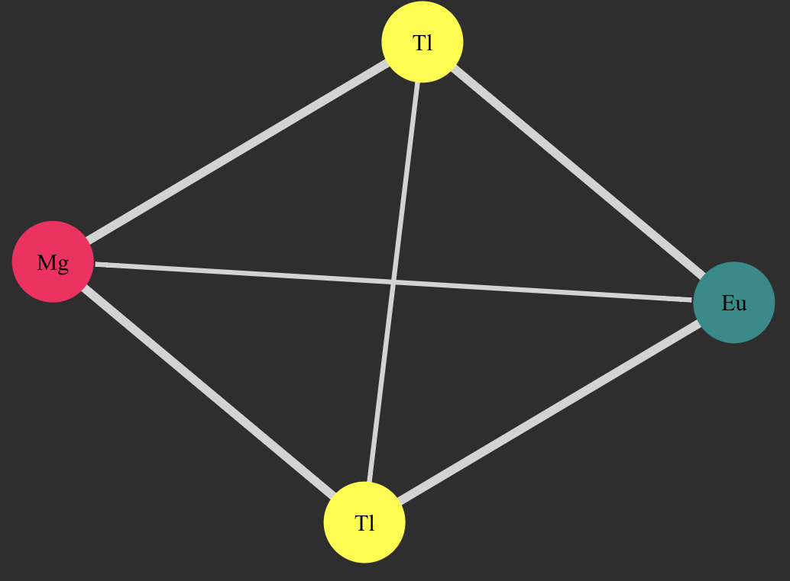
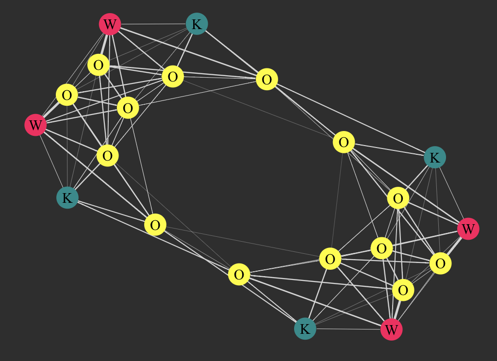

# CrystalGraphConvNets.jl
Herein you can find the beginnings of a package to implement [Crystal Graph Convolutional Neural Nets](https://arxiv.org/abs/1710.10324) in Julia. It makes use of the [Flux](https://fluxml.ai) ecosystem for model building and the [JuliaGraphs](https://github.com/JuliaGraphs) ecosystem for graph representation and visualization, as well as adapting some features from [GeometricFlux](https://github.com/yuehhua/GeometricFlux.jl).

**This is very much a work in progress! I make no promises/claims about performance, either in terms of speed or accuracy of model evaluation! I just wanted to get this code out into the community so that as things get improved, I can incorporate feedback and features based on interests of other folks! :D**

## Getting Started

1. Clone this package to wherever you want to play.

2. Go and try out the example in examples/example1/ – it has its own README file with detailed instructions.

## Features

* Build graphs (as [SimpleWeightedGraphs](https://github.com/JuliaGraphs/SimpleWeightedGraphs.jl)) from CIF files using [PyCall](https://github.com/JuliaPy/PyCall.jl) to [pymatgen](https://pymatgen.org) functions
* Visualization using [GraphPlot](https://github.com/JuliaGraphs/GraphPlot.jl), check out the `visualize_graph` function in the `graph_functions.jl` file, you can make pretty pictures like these, whether the graph is simpler or more complicated (thickness of connections indicates weight of edge in graph (higher weights for nearer neighbors)):

* Flexible featurization (currently onehot-style) and decoding: choose features to include, level of discretization, etc., and directly decode feature vectors to check values:

## Future plans
* make tests, docs
* fix random weird stuff as noted in comments
* more options for features, layers, network architectures...

## Contact
Please feel free to fork and play, and reach out here on GitHub or to rkurchin [at] cmu [dot] edu with suggestions, etc.!
