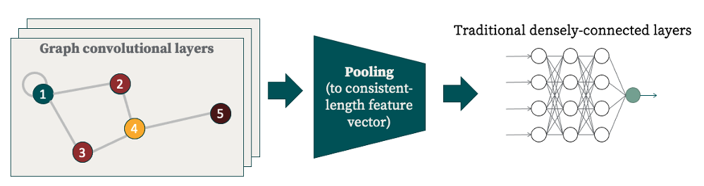

# Graph Convolutional Neural Networks

## Basic Architecture

This is the architecture of a typical graph convolutional neural network, or GCNN. There are three basic parts:
1) **Convolutional layers**: any user-defined number of these in succession
2) **Pooling layers**: Because input graphs may have differing numbers of nodes, but we want eventual output to be a standardized length, we need a pooling procedure to get the variable-length output of the convolutional layers to a standardized length. Typically this is via some kind of moving filter which could take (for example) the maxima or averages over each window.
3) **Dense layers**: Usually, the last few layers of the network are "standard" densely-connected layers.

## Why Graphs + CNNs?

Many machine learning architectures are constrained to working with 1-dimensional, regular, and uniform data structures. However, if presented with data represented in a structure (such as graphs) that doesn't quite fit this category, then typically the first step followed is to "steamroll" the data (using techniques such as dimensionality reduction) in an attempt to flatten it out, and essentially vectorize it. However, in doing so, vital spatial and structural aspects of the data are discarded. This is both philosophically unsatisfying and, pragmatically, can lead to spurious patterns being learned by models.

Structuring data as a graph and employing convolutional neural nets is an elegant and expressive solution to this conundrum. Graphs naturally encode connectedness between entities and convolutional kernels respect this locality in the way that information is propagated. 
