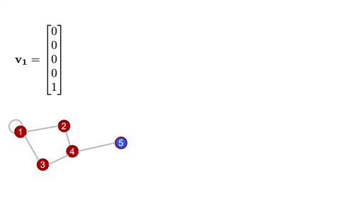

# Basic Graph Theory

A practical jumpstart, (and not an exhaustive resource), that introduces the bare minimum graph theory concepts to understand the math behind graph convolution.

## What is a graph?

A graph is structure that is open to multiple specialized interpretations, based on the domain in whose context it is considered. However, all these interpretations of a graph's definition can be essentially summarised to define a graph as a structure that represents a set of nodes connected by edges such that there exists some relation between the connected nodes.

In this package, we're interested in using graphs to represent structures made of atoms such as crystals and molecules. Think of those ball-and-stick models of atoms and molecules from high school chemistry class!

There are multiple methods, and data structures using which graphs can be represented in a machine understandable form. Out of these, the method that is of most interest to us, is using matrices, known popularly as the Adjacency Matrix notation.

## Adjacency matrix

An adjacency matrix is a square matrix of dimensions ``n \times n``, where ``n`` is the number of nodes in the graph being represented.\
The elements of the matrix indicate whether pairs of vertices (to which the indices in the matrix correspond) are adjacent or not in the graph.
Adjacency matrices corresponding to unweighted graphs are comprised solely of ``0's`` and ``1's``.

- **Weighted Graphs**\
  Weighted graphs are graphs whose adjacency matrix representations have a continuum of values, rather than only ``0's`` or ``1's``.\
  `AtomGraph` objects as defined in [ChemistryFeaturization.jl](https://github.com/aced-differentiate/ChemistryFeaturization.jl) are weighted graphs, and the weights are scaled (without loss of generality) such that the largest weight is equal to ``1``.\
  For more on how weights are calculated, see the [ChemistryFeaturization.jl documentation](thazhemadam.github.io/ChemistryFeaturization.jl/dev).

- **Directed Graphs**\

  A directed graph's adjacency matrix representation is always an asymmetric matrix.\
  *Note:* While generally all the atomic graphs we work with can be represented as a symmetric matrix, this need not be true in all cases.

## Degree matrix

The degree matrix of a graph is a diagonal matrix that describes how many edge terminations are at each node.

- **Weighted Graphs**\
  In a weighted graph, the degree matrix is constructed by summing the weights rather than just counting the nonzero entries in that row/column   of the adjacency matrix.

## Graph Laplacian

The Laplacian matrix (also called the graph Laplacian) is defined as the difference of the degree and adjacency matrices.

As the name suggests, this matrix is closely tied to the differential operator that comes up in, for example, the diffusion equation. The graph laplacian matrix as an operator is, in fact, diffusional in nature. To get a better sense of this, an illustration of the same can be found in the example below.

For a deeper dive into how graph Laplacian works, check [this](https://samidavies.wordpress.com/2016/09/20/whats-up-with-the-graph-laplacian/) out. But at this point, the more important thing, is to know that this in the most generalized sense, is how we graph convolution is performed.

In real applications, the "graph signal" is a feature matrix rather than a vector, as we'll generally have a vector of features for each node, and these get stacked to form the feature matrix. You can convince yourself with some basic linear algebra that the result of this is the same as if you applied the convolutional operation (i.e., multiplying by the Laplacian) to a bunch of vectors individually and stacked the results.

## Example

Now, that we have defined all the fundamentals we need to know, let us consider an example to illustrate, and get a better understanding of the same.

Consider the following graph, ``G``.


### Adjacency Matrix

Let ``A`` be the adjacency matrix for ``G``.

``A = \begin{bmatrix} 1 & 1 & 1 & 0 & 0 \\1 & 0 & 0 & 1 & 0\\1 & 0 & 0 & 1 & 0\\0 & 1 & 1 & 0 & 1\\0 & 0 & 0 & 1 & 0\\\end{bmatrix}``

### Degree Matrix

The degree matrix, ``D`` for ``G``, is as follows.

``D = \begin{bmatrix} 4 & 0 & 0 & 0 & 0 \\0 & 2 & 0 & 0 & 0\\0 & 0 & 2 & 0 & 0\\0 & 0 & 0 & 3 & 0\\0 & 0 & 0 & 0 & 1\\\end{bmatrix}``

### Laplacian Matrix

Let ``L`` be the graph Laplacian.

````L = D - A = \begin{bmatrix} 3 & -1 & -1 & 0 & 0 \\-1 & 2 & 0 & -1 & 0\\-1 & 0 & 2 & -1 & 0\\0 & -1 & -1 & 3 & -1\\0 & 0 & 0 & -1 & 1\\\end{bmatrix}````

### Graph Laplacian as an operator

The Laplacian matrix as an operator is diffusional in nature.\
Let's define a simple graph signal, just a single number at each node of the graph, and we'll start with a "delta spike" on node ``5`` and ``0s`` everywhere else.\
Watch, and infer what happens when we operate on that signal with the Laplacian a couple times.


## Analysis

A concise analysis that goes off on a tangent to discuss few facets that might be useful to understand before getting into graph convolution.

### Equivariance to node indexing

The results of the convolution, i.e., the set of feature vectors at each node, are independent of the order in which the nodes are indexed, and identified.\
This means to say that if and when the order of the column vectors is changed, the adjacency, degree, Laplacian, and feature matrices are all re-calculated accordingly, in just the right way for everything to work out. Try out the example above with different node labels, to see this in practice.

### Normalized Laplacian

A not-so-nice aspect of the graph Laplacian as defined here, is that the magnitude of the graph signal can change upon repeated convolutions. In practice, the [normalized Laplacian](https://en.wikipedia.org/wiki/Laplacian_matrix#Symmetric_normalized_Laplacian_2) is used, which is computed using the inverse square root degree matrix. This helps regulate things better.

### How is this related to image convolution?

For those familiar with image convolution (for those unfamiliar, there's a nice interactive tutorial [here](https://setosa.io/ev/image-kernels/)), it might not always be immediately obvious how this procedure is related.\
But, it turns out this is exactly the same thing. In typical image convolution, we've imposed a very rigid structure on the underlying graph namely that every node (pixel) has exactly the same sort of local structure (Cartesian neighbors).\
Graph convolution is more flexible, and allows for a more generalized notion of which "pixels" are "neighbors."
