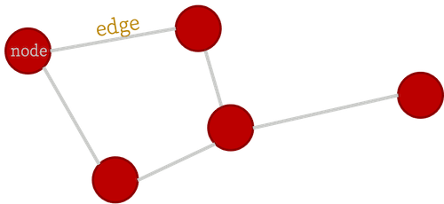

# Basic Graph Theory

A practical jumpstart, (and not an exhaustive resource), that introduces the bare minimum graph theory concepts to understand the math behind graph convolution.

## What is a graph?

A graph is an object described by a set of **nodes** and a set of **edges** that connect them:



This is a useful data structure for all kinds of things, such as [bridges in German cities](https://en.wikipedia.org/wiki/Seven_Bridges_of_K%C3%B6nigsberg) (the historical origin of graph theory), [social networks](https://en.wikipedia.org/wiki/Social_network_analysis) (in a more modern context), and many other applications. In this package, we're interested in using graphs to represent structures made of atoms such as crystals and molecules. Think of those ball-and-stick models of atoms and molecules from high school chemistry class!

In order to analyze graphs in a computer (for machine learning applications or otherwise), the first step is to assign an index to each node. It will turn out that for our purposes, it doesn't matter which node gets which label, which is very convenient!


Note that it is possible to have an edge with both ends connected to the same node (as shown in node 1 above), this is referred to as a **self-loop**.

The graph structure is represented on a computer using several types of matrices, defined below...

## Adjacency matrix

Arguably, the most fundamental matrix representing a graph (because it has all the information required to construct the other two types we will introduce) is the **adjacency matrix**. An adjacency matrix is a square matrix of dimensions ``n \times n``, where ``n`` is the number of nodes in the graph being represented. The entry at index _(i,j)_ in the adjacency matrix of an unweighted, undirected graph is 1 if node _i_ and _j_ are connected and zero otherwise.

For our sample graph above, the adjacency matrix is:

```math
A = \begin{bmatrix}
1 & 1 & 1 & 0 & 0\\
1 & 0 & 0 & 1 & 0\\
1 & 0 & 0 & 1 & 0\\
0 & 1 & 1 & 0 & 1\\
0 & 0 & 0 & 1 & 0\end{bmatrix}
```

A few variations exist...
- **Weighted Graphs**:
  Weighted graphs are graphs whose adjacency matrix representations have a continuum of values, rather than only ``0's`` or ``1's``. `AtomGraph` objects as defined in [ChemistryFeaturization.jl](https://github.com/aced-differentiate/ChemistryFeaturization.jl) are weighted graphs, and the weights are scaled (without loss of generality) such that the largest weight is equal to ``1``.\
  For more on how weights are calculated, see the [ChemistryFeaturization.jl documentation](thazhemadam.github.io/ChemistryFeaturization.jl/dev).

- **Directed Graphs**:
  A directed graph's adjacency matrix representation can be an asymmetric matrix. In other words, the edges of the graph have directionality. Atomic graphs are generally undirected.

## Degree matrix

The degree matrix of a graph is a diagonal matrix that describes how many edge terminations are at each node. For our sample graph, the degree matrix is given by:

```math
D = \begin{bmatrix}
4 & 0 & 0 & 0 & 0\\
0 & 2 & 0 & 0 & 0\\
0 & 0 & 2 & 0 & 0\\
0 & 0 & 0 & 3 & 0\\
0 & 0 & 0 & 0 & 1\end{bmatrix}
```

In a weighted graph, the degree matrix is constructed by summing the weights rather than just counting the nonzero entries in that row/column of the adjacency matrix.

## Graph Laplacian

The Laplacian matrix (also called the graph Laplacian) is defined as the difference of the degree and adjacency matrices.

```math
L = D - A = \begin{bmatrix}
3 & -1 & -1 & 0 & 0\\
-1 & 2 & 0 & -1 & 0\\
-1 & 0 & 2 & -1 & 0\\
0 & -1 & -1 & 3 & -1\\
0 & 0 & 0 & -1 & 1\end{bmatrix}
```

As the name suggests, this matrix is closely tied to the differential operator that comes up in, for example, the diffusion equation. The graph laplacian matrix as an operator is, in fact, _diffusional_ in nature. To get a better sense of this, let's define a simple graph signal, just a single number at each node of the graph, and we'll start with a "delta spike" on node 5 and zeros everywhere else. Watch what happens when we operate on that signal with the Laplacian a couple times...


For a deeper dive into how graph Laplacian works, check [this](https://samidavies.wordpress.com/2016/09/20/whats-up-with-the-graph-laplacian/) out. But at this point, the more important thing, is to know that this in the most generalized sense, is how we graph convolution is performed.

In real applications, the "graph signal" is a feature matrix rather than a vector, as we'll generally have a vector of features for each node, and these get stacked to form the feature matrix. You can convince yourself with some basic linear algebra that the result of this is the same as if you applied the convolutional operation (i.e., multiplying by the Laplacian) to a bunch of vectors individually and stacked the results.

## Remarks

A concise analysis that goes off on a tangent to discuss few facets that might be useful to understand before getting into graph convolution.

### Equivariance to node indexing

The results of the convolution, i.e., the set of feature vectors at each node, are independent of the order in which the nodes are indexed, and identified. That is, if we relabel nodes with different indices, the adjacency, degree, Laplacian, and feature matrices are all re-calculated accordingly, in just the right way for everything to work out. Try out the example above with different node labels, to see this in practice.

### Normalized Laplacian

A not-so-nice aspect of the graph Laplacian as defined here, is that the magnitude of the graph signal can change upon repeated convolutions. In practice, the [normalized Laplacian](https://en.wikipedia.org/wiki/Laplacian_matrix#Symmetric_normalized_Laplacian_2) is used, which is computed using the inverse square root degree matrix. This helps regulate things better.

### How is this related to image convolution?

For those familiar with image convolution (for those unfamiliar, there's a nice interactive tutorial [here](https://setosa.io/ev/image-kernels/)), it might not always be immediately obvious how this procedure is related. But, it turns out this is _exactly_ the same thing. In typical image convolution, we've imposed a very rigid structure on the underlying graph namely that every node (pixel) has exactly the same sort of local structure (Cartesian neighbors). Graph convolution is more flexible, and allows for a more generalized notion of which "pixels" are "neighbors."
